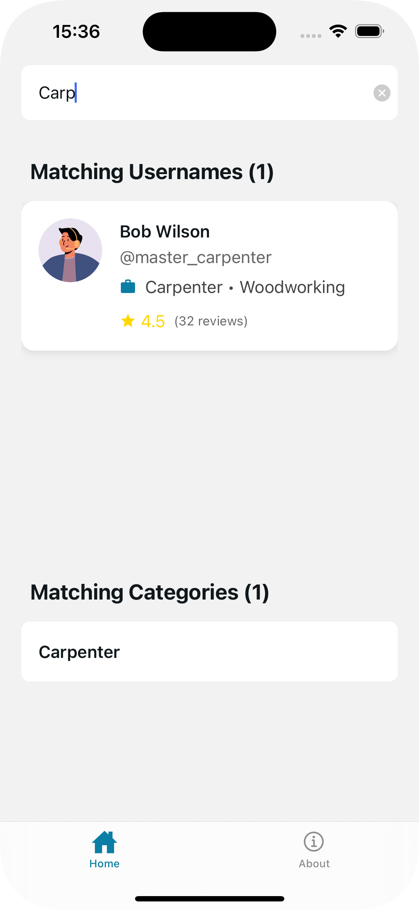

# ServiceFinder App

ServiceFinder is a React Native application built with Expo that allows users to search and find various service providers based on their categories and usernames.

## Features

- Search for service providers by username or category.
- Instant filtering as you type.
- Simple and user-friendly interface.

## Screenshots

<!-- 
 -->


## Get Started

### Prerequisites

Ensure you have the following installed on your machine:

- [Node.js](https://nodejs.org/)
- [Expo CLI](https://docs.expo.dev/get-started/installation/)

### Installation

1. Clone the repository:

   ```bash
   git clone https://github.com/stevejoels54/ServiceFinder.git
   cd ServiceFinder
   ```

2. Install dependencies:

   ```bash
   npm install
   ```

3. Start the development server:

   ```bash
   npx expo start
   ```

4. Scan the QR code using the **Expo Go** app on your mobile device or run it on an emulator.

## Project Structure

```
ServiceFinder/
├─ .expo/
│  ├─ README.md
│  ├─ devices.json
│  └─ types/
│     └─ router.d.ts
├─ .gitignore
├─ .vscode/
│  └─ .react/
├─ README.md
├─ app/
│  ├─ (tabs)/
│  │  ├─ _layout.tsx
│  │  ├─ about.tsx
│  │  └─ index.tsx
│  ├─ +not-found.tsx
│  └─ _layout.tsx
├─ app.json
├─ assets/
│  ├─ fonts/
│  │  └─ SpaceMono-Regular.ttf
│  ├─ images/
│  │  ├─ adaptive-icon.png
│  │  ├─ developer-avatar.png
│  │  ├─ favicon.png
│  │  ├─ icon.png
│  │  ├─ partial-react-logo.png
│  │  ├─ react-logo.png
│  │  ├─ react-logo@2x.png
│  │  ├─ react-logo@3x.png
│  │  └─ splash-icon.png
│  └─ screenshots/
│     ├─ search1.png
│     ├─ search2.png
│     ├─ search3.png
│     └─ search4.png
├─ components/
│  ├─ Collapsible.tsx
│  ├─ ExternalLink.tsx
│  ├─ HapticTab.tsx
│  ├─ HelloWave.tsx
│  ├─ ParallaxScrollView.tsx
│  ├─ ThemedText.tsx
│  ├─ ThemedView.tsx
│  ├─ __tests__/
│  │  ├─ ThemedText-test.tsx
│  │  └─ __snapshots__/
│  │     └─ ThemedText-test.tsx.snap
│  └─ ui/
│     ├─ IconSymbol.ios.tsx
│     ├─ IconSymbol.tsx
│     ├─ TabBarBackground.ios.tsx
│     ├─ TabBarBackground.tsx
│     └─ ThemedTouchableOpacity.tsx
├─ constants/
│  └─ Colors.ts
├─ data/
│  └─ SampleProviders.ts
├─ expo-env.d.ts
├─ hooks/
│  ├─ useColorScheme.ts
│  ├─ useColorScheme.web.ts
│  └─ useThemeColor.ts
├─ package-lock.json
├─ package.json
├─ scripts/
│  └─ reset-project.js
├─ tsconfig.json
└─ types/
   └─ ServiceProvider.tsx

```

## Author

- **Joel Steven Ssekyewa**
- **GitHub:** [stevejoels54](https://github.com/stevejoels54)

## License

This project is licensed under the MIT License - see the [LICENSE](LICENSE) file for details.
